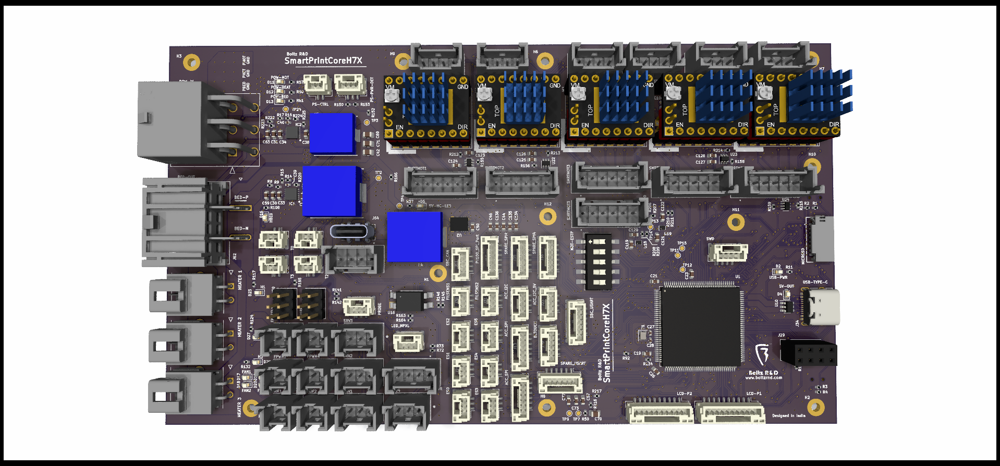
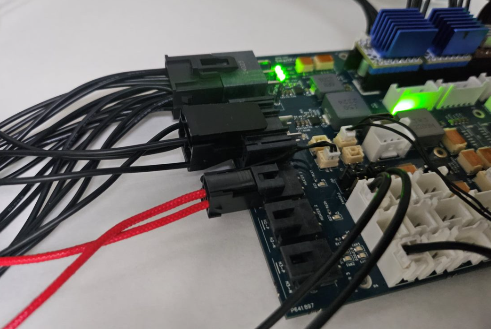
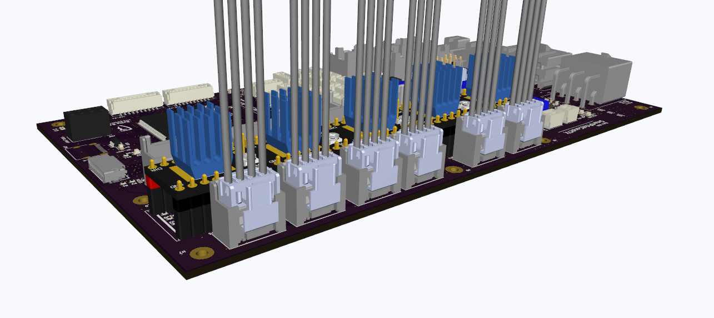

        The SmartPrintCoreH7x is an open-source 3D printer mainboard based on the STM32H7 series microcontroller.
        Copyright (C) 2024 Boltz R&D

        This Project is free Hardware: you can redistribute it and/or modify
        it under the terms of the GNU General Public License as published by
        the Free Software Foundation, either version 3 of the License, or
        (at your option) any later version.

        This Hardware is distributed in the hope that it will be useful,
        but WITHOUT ANY WARRANTY; without even the implied warranty of
        MERCHANTABILITY or FITNESS FOR A PARTICULAR PURPOSE.  See the
        GNU General Public License for more details.

        You should have received a copy of the GNU General Public License
        along with this program.  If not, see <https://www.gnu.org/licenses/>.

Contact - info@boltzrnd.com

# SmartPrintCoreH7x
### Now Available to Buy from <a href="https://boltzrnd.com">Boltz R&D Store</a> , We are Shipping Globally!

SmartPrintCoreH7X © 2024 by Boltz R&D is licensed under GPL V3. To view a copy of this license, visit https://www.gnu.org/licenses/gpl-3.0.en.html ---------------

The SmartPrintCoreH7x is an open-source 3D printer mainboard based on the STM32H7 series microcontroller. It includes 5+1 stepper drivers, with the option to expand by adding more sets of 5 drivers through the upcoming "SmartPrintCore Extravaganza". With a jumper-less setup and a design built for flexibility, SmartPrintCoreH7x is dedicated for makers, tinkerers, and the industry to build and customize.

The Board utilizes self-locking Molex MegaFit(Power Input), Ultra-Fit Tangless (Hotend Heaters), Mini-Lock(Motors and power peripherals) and JST-GH (Digital and IO Peripherals), for easy and worry-free connections.

The board also includes multiple TI Buck converters with more than 90% efficiencies for multiple peripherals
1. 12V 5A Fan and Peripheral Supply
2. 5V 5A Fan and Peripheral supply
3. 5V 10A SBC Supply (Optional, Can be powered by Peripheral Supply, using resistor jumpers in production)

Other notable features include -
1. Compatibility with 12V/24V power supplies
2. Auto power source selection for Board supply from USB/Main Supply.

Theraml Considerations - 
1. Low RDS(on) Mosfets are used for minimal losses, which also allows heatsink-less operation for average use cases
2. The PCB design prioritizes heat management, with strategically placed components and optimized power traces that ensure optimal cooling.

## All Features

1. Open-source design, accessible and modifiable.
2. Developed in KiCad.
3. Powered by STM32H723 MCU.
4. Supports 5+1 Stepper motors (Expandable in multiples of 5 using SmartPrintCore Extravaganza expansion board).
5. Supports dedicated five closed-loop external stepper ports.
6. USB-C with auto power switching for seamless MCU power management without setting jumpers.
10. Four PWM and two always-on fan ports (Total 6 Fan ports).
11. Dual voltage compatibility with 24V and 12V power supplies.
12. Four servo channels.
13. Single side-entry locking connector for simplified power input.
14. TI buck converters ensure efficient and reliable power supply to SBC and components.
15. Dedicated 5V supply for SBC (10A max, to support Bigger LCD and other SBC peripherals) with locking connector and Type-C port.
16. Auxiliary power: 5V 5A and 12V 5A for peripherals and fans.
17. 3.3V 1A auxiliary supply for Wi-Fi modules and small devices.
18. High-efficiency MOSFETs for cooler operation.
19. 15A heated bed with a locking connector.
20. Three high-power heaters with locking connectors.
22. Onboard slow-burning fuse for added safety.
    - Optional: External additional inline fuses for power input are recommended (included in BOM).
24. DIP switch configuration for easy sensorless homing setup.
25. Preconfigured switchable microstepping with preinstalled SMD resistors.
26. Buffered signals for motor SPI and UART.
27. Supports both Marlin and Klipper firmware.
28. Clearly marked stepper drivers for easy orientation identification and setup.

## Ports Overview

| Port Category          | Quantity                | Details                                  |Recommended Rating(Operating)        | Current Rating (Absolute Max Unless Notified)|
|------------------------|-------------------------|------------------------------------------|-------------------------------------|----------------------------------------------|
| Power Input            | 1                       | 6-in-1; Min: 12V, Max - 24V              | 15A                                 | 60A Total: 20A BED, 20A Motors, 20A Heaters  |
| Steppers               | 5 (+1)                  | 2 Ports for Z Stepper                    | 15A                                 | 20A                                          |
| Smart Steppers Port    | 5 (+1)                  |                                          | 15A                                 | 20A                                          |
| Heaters                | 3                       |                                          | 15A                                 | 20A                                          |
| Bed Heaters            | 1                       |                                          | 15A                                 | 20A                                          |
| Accelerometer          | 3 (Total)               | 1 x SPI 3.3V, 1 x I2C 5V, 1 x I2C 3.3V   | 0.5A                                | 1A                                           |
| ESP-01 UART            | 1                       |                                          | 0.5A                                | 1A                                           |
| FAN                    | 6                       | 4 x PWM + 2 x Always On, Switchable      | 2A each port,4A across all ports    | 5A                                           |
| Servo                  | 4                       |                                          | 2A each port,4A across all ports    | 5A                                           |
| Aux Servo Power        | 1                       | 5V                                       | 4A                                  | 5A                                           |
| SPI (Spare)            | 3                       | 1 x 3.3V + 2 x 5V                        | 0.5A                                | 1A 5V, 0.2A 3.3V                             |
| PT100 SPI Port         | 1                       |                                          | 0.2A                                | 0.2A                                         |
| USART                  | 2                       |                                          | 1A                                  | 2A                                           |
| SBC Supply             | 2                       | 1 x 4-pin Connector + 1 x Type C         | 8A                                  | 10A                                          |
| CAN                    | 1                       |                                          | 0A(No Power on CAN Port)            | 0A                                           |
| Temperature Sensors    | 4                       |                                          | N/A                                 | N/A                                          |
| Endstops               | 6                       |                                          | N/A                                 | N/A                                          |
| Filament Sensors       | 2                       |                                          | N/A                                 | N/A                                          |
| LCD Connector Set      | 1                       |                                          | 1A                                  | 2A                                           |
| SWD                    | 1                       |                                          | N/A                                 | N/A                                          |
| PS CTRL                | 1                       |                                          | N/A                                 | N/A                                          |
| PS PWR DET             | 1                       |                                          | N/A                                 | N/A                                          |
| Neopixel LED Port      | 1                       |                                          | 1A                                  | 2A                                           |
| BLTOUCH Port           | 1                       |                                          | 1A                                  | 2A                                           |
| Probe                  | 1                       |                                          | 1A                                  | 2A                                           |
| MicroSD                | 1                       |                                          | N/A                                 | N/A                                          |

## Jumpers and Configurations

| Configuration               | Options                           | Description                                 |
|-----------------------------|-----------------------------------|---------------------------------------------|
| Sensorless Homing           | 1                                 | Configurable through onboard DIP switches   |
| Fan Voltage Selection       | 2                                 | Selectable voltages: 12V, 5V, or POWER_IN   |

## Design Considerations
To optimize general usage and simplify installation, the following design features have been incorporated:

1. **External Inline Fuses**: Installed beyond the power supply line for easy fuse replacement without the need to dismantle the mainboard section of your printer.
2. **Pre-Configured Stepper Jumpers**:
   - Jumpers are preset to high using 0402 resistors, eliminating the need for manual adjustments.
   - MSX bit changes are managed via firmware if you are utilizing hardware settings.
   - Note: A4988/DRV8266 and SPI-based drivers cannot be mixed and used concurrently without soldering additional 0402 configuration resistors.

## Contribute to the SmartPrintCore Open Source Project Lineups

We are actively looking for contributors to keep this project alive, Join us in making 3D printing more accessible, reliable, and fun for everyone. Let's create, innovate, and inspire the future, one layer at a time.

Feature Requests and Bug Reports are most welcome :)

## Buy From
1. Boltz R&D - Contact us at info@boltzrnd.com or Buy Directly from https://www.boltzrnd.com
2. -- More to Come --

Interested in becoming a listed manufacturer? Reach out to us at info@boltzrnd.com to add your store link here.

## Compatible Accesories -
1. Cases -
Note - Stay tuned to our Thingiverse channel to be the first one to know - https://www.thingiverse.com/boltzrnd/designs

# Story Time

### How It Was Created
SmartPrintCoreH7x was born out of a combination of long commute hours and a renewed passion for building. With 7 hours a day of travel time, a result of embarking on an exciting single life, there was a great opportunity to reconnect with my hobby of creating innovative hardware. Fueled by endless cups of Chai Tea and free time, I found a new rhythm between the rails and circuits.

### Why It Was Created
The motivation behind SmartPrintCoreH7x is rooted in both personal need and a broader vision for the 3D printing community:
- **High-Speed Performance**: Designed to handle extremely high printing speeds of 3000 mm/s or more.
- **Unmatched Control**: Providing complete control over the hardware, allowing for extensive customization and modification at any time to meet evolving needs, for any organization and individuals.
- **Reliable and Easy Connections**: To eliminate common issues with connectivity in intensive printing operations.
- **Open Source Commitment**: Ensuring the hardware remains open and accessible, allowing anyone to modify and improve upon the design without restriction.
- **Safety and Reliability**: Integrating robust power supplies to safeguard the system, particularly enhancing the performance and reliability of connected Single Board Computers (SBCs).

# Commitment to Open Source

**Note:** In celebration of our dedication to open-source hardware and software, Boltz R&D endorses the use of BeaglePlay and BeagleBone SBCs with SmartPrintCoreH7X. We are committed to actively supporting the community by ensuring seamless interfacing and integration of these setups or similar setups.

# Extra notes

1. Marlin Configuration is still under development, Please Raise a requirement on discord to prioritize it above other tasks if needed.
2. The Component Libraries are not included and redistributed because of license restrictions, contact us to join our organisation as a "contributor" to access the part libraries for development.
3. Custom 3D Printed casing is under development and evaluation, and is expected to release by end of May 2024.
4. The Klipper Configuration files are minimal, and will require some modifications to fit your use case, reach out to us whenever in doubt.
5. Feel Free to reach out to our discord server for any queries related to integration, development and production.
6. You can also send us feature requests that you'd like to see in the next versions of the board.

# Disclaimer

The SmartPrintCoreH7x is an open-source project provided by Boltz R&D. It is offered "as is" and without any warranties or guarantees, express or implied.

Boltz R&D provides no warranty of any kind regarding the safety, reliability, durability, and performance of the SmartPrintCoreH7x. By using this project's design, software, or hardware, you expressly acknowledge and agree that you assume all risks associated with its use.

Boltz R&D shall not be liable for any claims, damages, or other liabilities whatsoever, whether in an action of contract, tort or otherwise, arising from, out of, or in connection with the SmartPrintCoreH7x or the use or other dealings in this project.

This project is provided as an open-source resource for the community to use, modify, and distribute subject to the terms of the GPL V3 license. All third parties manufacturing, selling, or using the SmartPrintCoreH7x are responsible for ensuring that their products and services comply with all applicable laws and regulations.

Users are responsible for compliance with local laws, and for ensuring that appropriate safety measures are in place when manufacturing, using, or modifying the SmartPrintCoreH7x mainboard.

